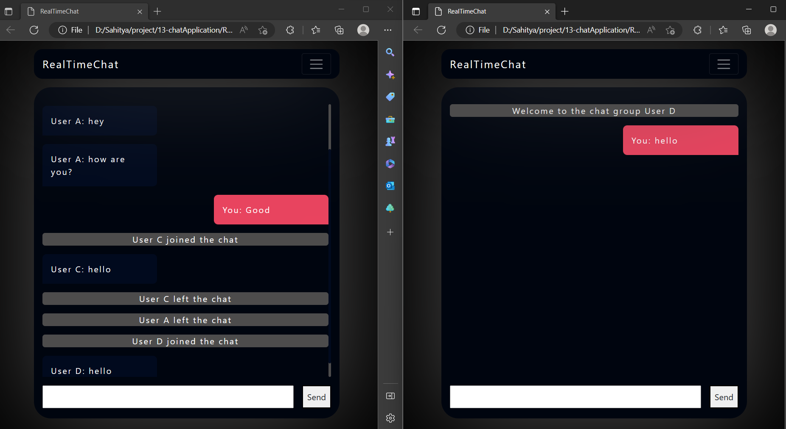

# RealTimeChatApp

## How to use the chat app
    - Download the client and chat folder from git.
    - Run the app.js file using node in server folder and keep it running.
    - Now open the client folder and run home.html file to join the chat group.
    - You can open as many client files as you want.

## Working
    - This app is built using socket.io api.
    - The client side is static website which links to the server using JavaScript.
    - The server runs using node and the server need to keep running so that the client can connect to the server.

