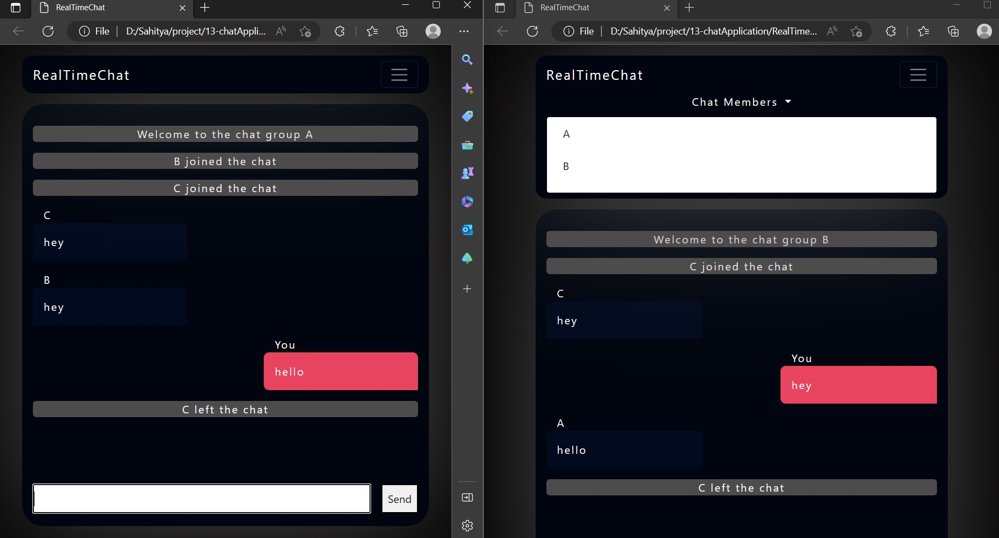

# RealTimeChatApp

## How to use the chat app
- Download the client and chat folder from git.
- Run the app.js file using node in server folder and keep it running.
- Now open the client folder and run home.html file to join the chat group.
- You can open as many client files as you want.

## Technology Stack
- HTML
- CSS
- JavaScript
- Node.js
- Socket.io

## About
- This app is built using socket.io api.
- The app lets any number of users join and chat among themselves.

## Sample Image

